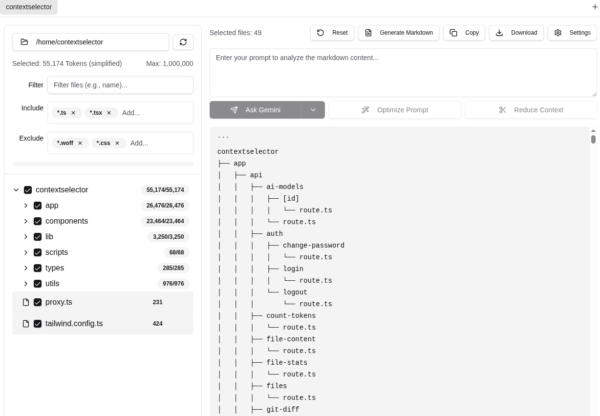
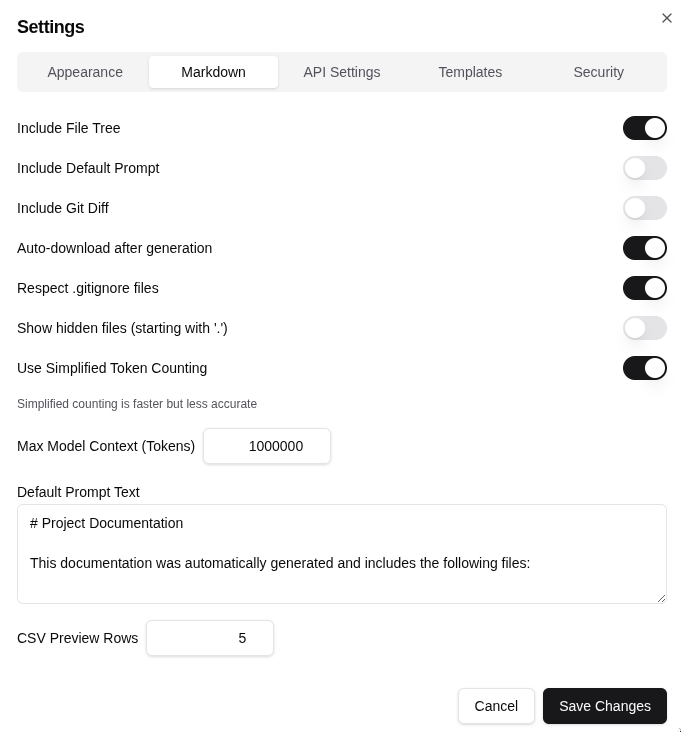
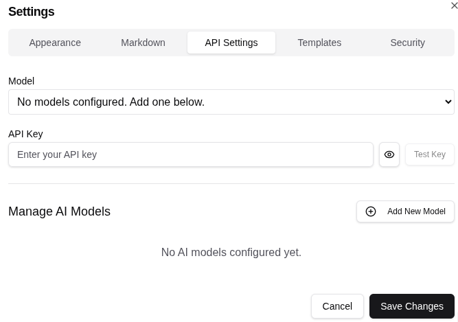
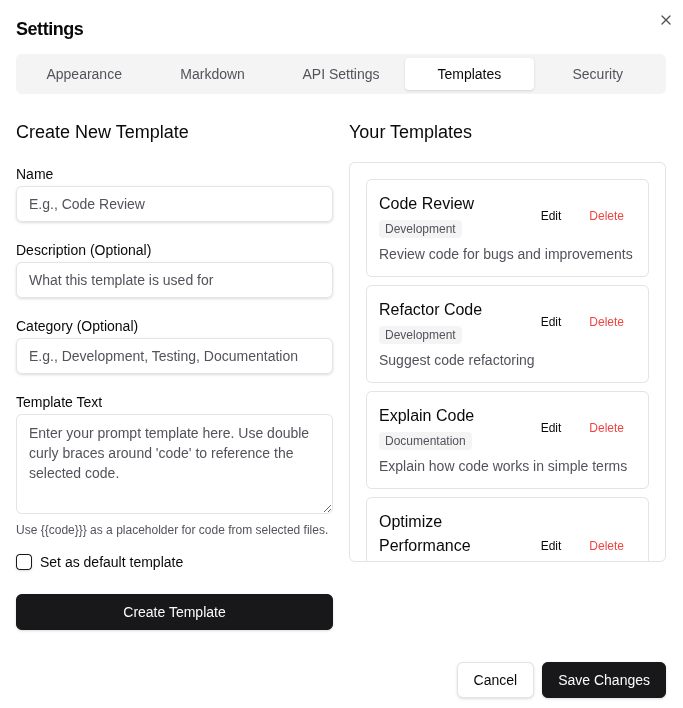
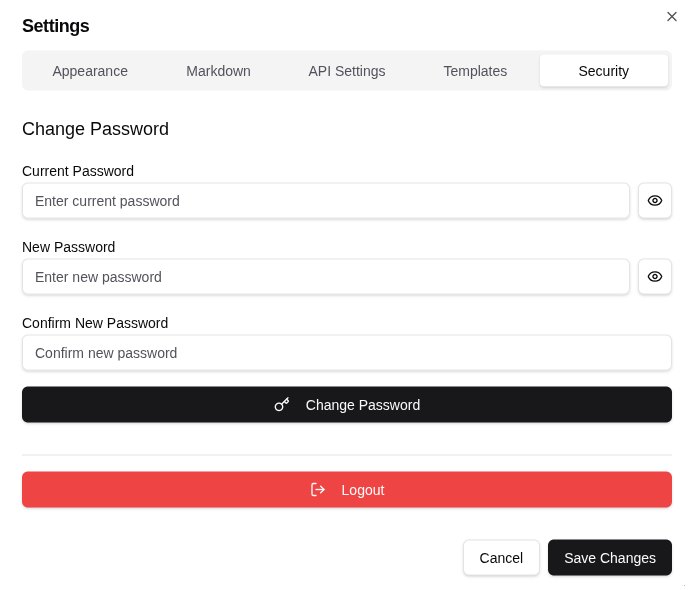

# Context Selector

Context Selector launches a local web UI for exploring a codebase, selecting the exact files you want, and generating structured markdown context for Gemini workflows.



## Install and run

**Requirements:** Node.js `>=20.18.0`, npm, and a local browser.

Run without installing:

```bash
npx contextselector
```

Install globally:

```bash
npm install -g contextselector
contextselector
```

Open a specific workspace:

```bash
contextselector /path/to/project --no-open
```

Useful options:

```text
contextselector [workspace] [--port 3001] [--host 127.0.0.1] [--data-dir /path/to/data] [--open|--no-open]
```

The app starts on `127.0.0.1:3001` by default and automatically moves to the next free port if needed.

## First launch

Runtime data is created in `~/.contextselector` by default, or in `$XDG_DATA_HOME/contextselector` when XDG is configured. You can override this with `--data-dir` or `CONTEXTSELECTOR_DATA_DIR`.

The first launch creates a local SQLite database and default login:

- **Username:** `admin`
- **Password:** `123456`

Change the password after signing in.

## What it does

- Browse a local workspace in a file tree
- Filter files with include and exclude glob patterns
- Select files or folders and preview contents before export
- Generate markdown with optional file tree, prompt text, git diff, and CSV previews
- Track token counts against a configurable model context limit
- Reuse prompt templates
- Pick a Gemini model and test a Gemini API key locally
- Manage multiple project tabs

## Screenshots

### Workspace selection and markdown generation


Use the left pane to filter and select files, then generate, copy, or download the combined markdown on the right.

### Markdown settings



Configure file tree inclusion, git diff inclusion, hidden file behavior, token counting mode, default prompt text, and CSV preview rows.

### API settings



Choose a supported Gemini model, enter an API key for the current session, and test that key before sending prompts.

### Template management



Create reusable prompt templates, organize them with optional categories, and edit or delete saved templates from the same dialog.

### Security settings



Change the local password and log out directly from the settings dialog.

## Security and privacy

- Authentication is local and uses HTTP-only cookies.
- Prompt templates, UI settings, and auth data are stored only in the local runtime SQLite database.
- Gemini API keys entered in the UI are **not** written to SQLite; they stay in browser memory for the active session only.
- The package is meant for local use against directories you choose to open.

## Development

Clone the repository for development:

```bash
git clone https://github.com/tayor/contextselector.git
cd contextselector
npm install
```

Run the app locally:

```bash
npm run dev
```

`npm run dev` and `npm run start` initialize or migrate the local database automatically and provision the local auth secret used for login sessions. `npm run init-db` is still available if you want to run the database step manually.

Available scripts:

```bash
npm run lint
npm run build
npm run start
npm run init-db
```

## Project structure

- `app/` - Next.js app router pages and API routes
- `components/` - shared UI and file explorer components
- `lib/` - auth, database, runtime helpers, and state
- `scripts/` - database initialization scripts
- `utils/` - file and token utilities
- `assets/` - screenshots used in documentation

## License

MIT
